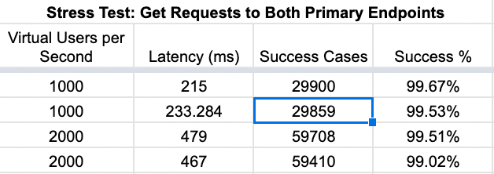
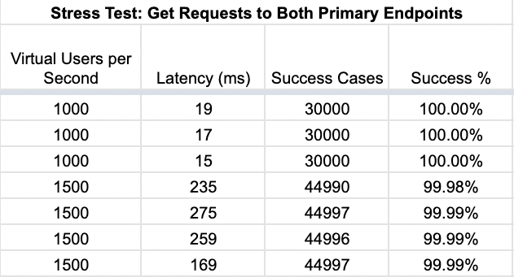

# Atelier: Database System Design, RESTful API
Developed RESTful API and database for an inherited front-end E-Commerce codebase with over 25M records in CSVs

### Tech

Node.js, Express.js, PostgreSQL, Nginx, AWS, K6, Loader.io, Docker, Jest

# Performance Testing - Local
GOAL: All requests:
- Response time < 50ms / ideally 10ms

METHOD: Tested using PSQL 'explain analyze' cmd
- ProductId = 1

GOAL: All requests (Stress testing)
- Response time: less than 2,000ms / ideally 200ms
- Throughput: 1,000 RPS ideally 10,000rps

METHOD: Testing with K6
- Product ID: Randomized 1 - 500
- Duration: 1m

# Performance Testing - Deployed in AWS EC2 (t2.micros)
GOAL: Scale to
- Response time: less than 2000ms
- Throughput: 1000 RPS

METHOD: Testing with loader.io

CONSTRAINTS:
- No AWS Services: RDS, Elastic Beanstalk, etc
- Cannot VERTICALLY scale
- Must have < 1% error rate to pass

TEST:
- Single instance of Node server

RESULTS:
- All queries able to handle 1,500 RPS

TEST:
- Two instances of Node Server, with Nginx Load Balancing

Results:
- All Queries able to handle 2,400 RPS

# Future Development
- Compare performance with NoSQL database
- Scale to 4 instances for clarity on optimal Load Balancing methods
- Implement and utilize caching and worker connections on Load Balancer
